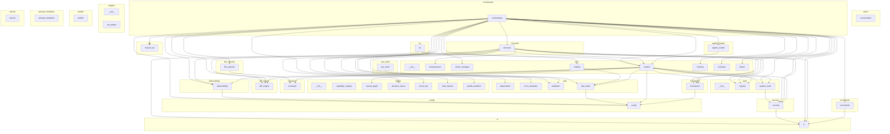

```mermaid
graph TD
    subgraph agents_loader
        agents_loader_agents_loader["agents_loader"]
    end
    subgraph bridge
        bridge_core_patterns["__init__"]
        bridge_core_patterns_capability_registry["capability_registry"]
        bridge_core_patterns_causal_graph["causal_graph"]
        bridge_core_patterns_decision_tracer["decision_tracer"]
        bridge_core_patterns_event_bus["event_bus"]
        bridge_core_patterns_fault_injector["fault_injector"]
        bridge_core_patterns_profile_manifest["profile_manifest"]
    end
    subgraph checkpoint
        checkpoint_checkpoint["checkpoint"]
    end
    subgraph commands
        commands_commands["commands"]
    end
    subgraph config
        config_config["config"]
    end
    subgraph constants
        constants_constants["constants"]
    end
    subgraph core
        core_core["__init__"]
        core_core_backpressure["backpressure"]
        core_core_cache_manager["cache_manager"]
        core_core_context["context"]
        core_core_healing["healing"]
        core_core_memory["memory"]
        core_core_schemas["schemas"]
        core_core_theme["theme"]
    end
    subgraph demo
        demo_demo_conversation["conversation"]
    end
    subgraph diff_engine
        diff_engine_diff_engine["diff_engine"]
    end
    subgraph executor
        executor_executor["executor"]
    end
    subgraph file_watcher
        file_watcher_file_watcher["file_watcher"]
    end
    subgraph gfx
        gfx_gfx_mascot_tui["mascot_tui"]
    end
    subgraph observability
        observability_observability["observability"]
    end
    subgraph orchestrator
        orchestrator_orchestrator["orchestrator"]
    end
    subgraph plugins
        plugins_plugins["__init__"]
        plugins_plugins_ww_plugin["ww_plugin"]
    end
    subgraph profiler
        profiler_profiler["profiler"]
    end
    subgraph prompt_templates
        prompt_templates_prompt_templates["prompt_templates"]
    end
    subgraph security
        security_security["security"]
    end
    subgraph tools
        tools_tools["__init__"]
        tools_tools_registry["registry"]
        tools_tools_system_tools["system_tools"]
    end
    subgraph tui
        tui_tui["tui"]
    end
    subgraph tutorial
        tutorial_tutorial["tutorial"]
    end
    subgraph ui
        ui_ui["ui"]
    end
    subgraph utils
        utils_core_utils_deprecation["deprecation"]
        utils_core_utils_error_translator["error_translator"]
        utils_core_utils_validation["validation"]
        utils_core_utils_web_client["web_client"]
    end
    subgraph ww_client
        ww_client_ww_client["ww_client"]
    end
    agents_loader_agents_loader --> core_core_context
    checkpoint_checkpoint --> config_config
    commands_commands --> ui_ui
    core_core_context --> checkpoint_checkpoint
    core_core_context --> config_config
    core_core_context --> constants_constants
    core_core_context --> bridge_core_patterns_causal_graph
    core_core_context --> utils_core_utils_web_client
    core_core_context --> diff_engine_diff_engine
    core_core_context --> observability_observability
    core_core_context --> security_security
    core_core_context --> tools_tools_registry
    core_core_context --> tools_tools_system_tools
    core_core_healing --> utils_core_utils_web_client
    utils_core_utils_web_client --> config_config
    executor_executor --> checkpoint_checkpoint
    executor_executor --> core_core_backpressure
    executor_executor --> core_core_context
    executor_executor --> bridge_core_patterns_decision_tracer
    executor_executor --> bridge_core_patterns_fault_injector
    executor_executor --> utils_core_utils_validation
    executor_executor --> diff_engine_diff_engine
    executor_executor --> observability_observability
    executor_executor --> security_security
    executor_executor --> tools_tools_registry
    executor_executor --> ui_ui
    file_watcher_file_watcher --> constants_constants
    observability_observability --> config_config
    orchestrator_orchestrator --> agents_loader_agents_loader
    orchestrator_orchestrator --> checkpoint_checkpoint
    orchestrator_orchestrator --> commands_commands
    orchestrator_orchestrator --> config_config
    orchestrator_orchestrator --> core_core_cache_manager
    orchestrator_orchestrator --> core_core_context
    orchestrator_orchestrator --> core_core_healing
    orchestrator_orchestrator --> core_core_memory
    orchestrator_orchestrator --> bridge_core_patterns_event_bus
    orchestrator_orchestrator --> bridge_core_patterns_profile_manifest
    orchestrator_orchestrator --> core_core_schemas
    orchestrator_orchestrator --> core_core_theme
    orchestrator_orchestrator --> utils_core_utils_deprecation
    orchestrator_orchestrator --> utils_core_utils_error_translator
    orchestrator_orchestrator --> utils_core_utils_validation
    orchestrator_orchestrator --> diff_engine_diff_engine
    orchestrator_orchestrator --> executor_executor
    orchestrator_orchestrator --> file_watcher_file_watcher
    orchestrator_orchestrator --> gfx_gfx_mascot_tui
    orchestrator_orchestrator --> observability_observability
    orchestrator_orchestrator --> security_security
    orchestrator_orchestrator --> tools_tools_registry
    orchestrator_orchestrator --> tools_tools_system_tools
    orchestrator_orchestrator --> ui_ui
    security_security --> ui_ui
    tools_tools_system_tools --> core_core_context
    tools_tools_system_tools --> security_security
    tui_tui --> core_core_context
    tui_tui --> ui_ui
    ww_client_ww_client --> utils_core_utils_web_client
```
